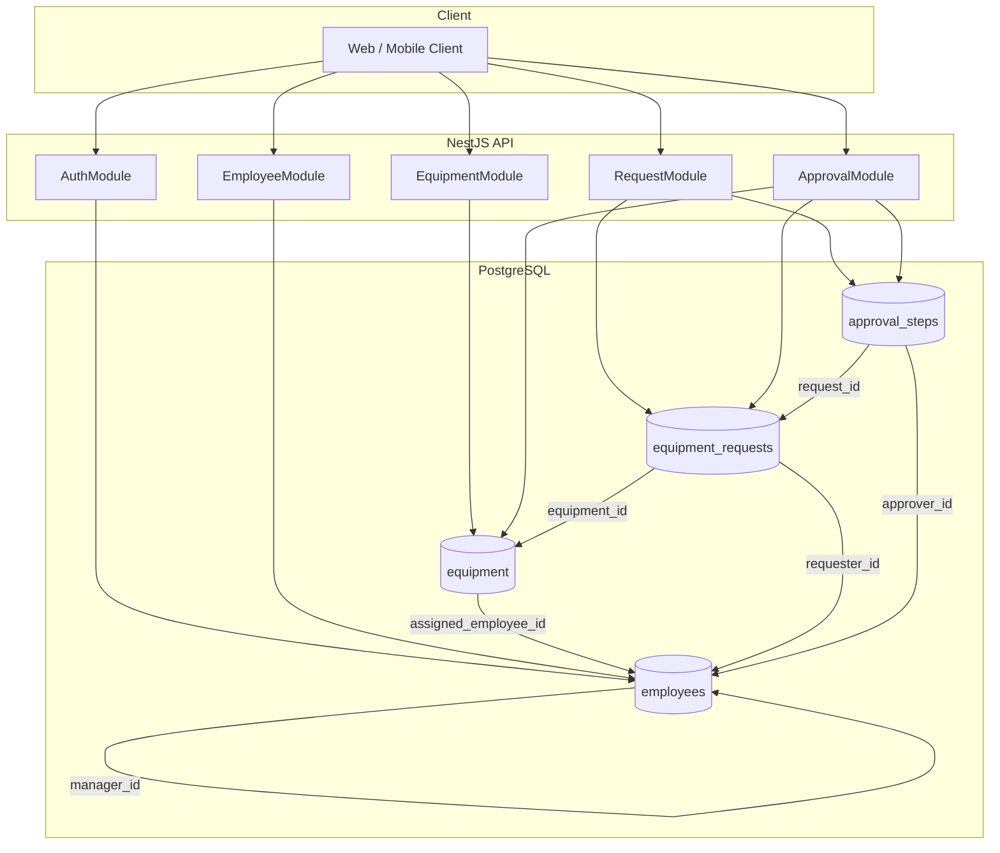
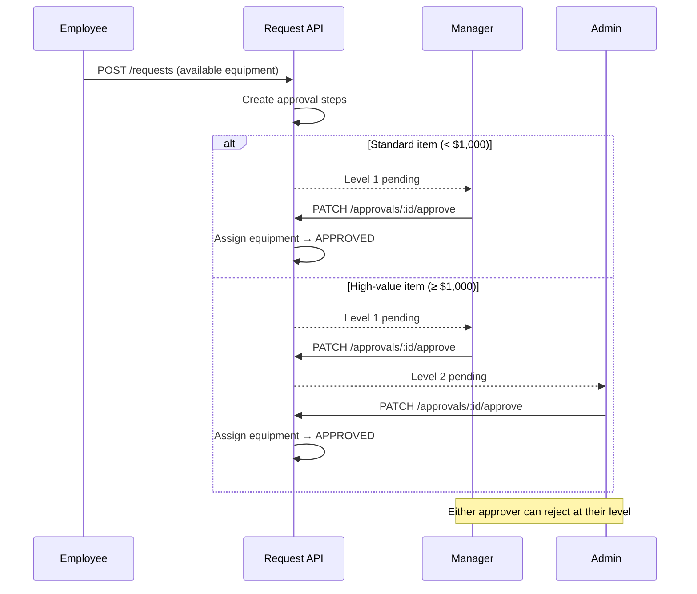

# Equipment Request API

A NestJS REST API for managing company equipment inventory, employee equipment requests, and multi-level approval workflows. Employees can request available equipment; managers approve standard items, while high-value items (≥ $1,000) require an additional admin approval.

## Features

- **Equipment management** — CRUD for inventory with assignment tracking and monetary value
- **JWT authentication** — Register, login, role-based access (`admin`, `user`)
- **Equipment requests** — Employees submit requests for available equipment
- **Multi-level approvals** — Manager approval for all requests; admin approval for high-value items
- **Approval comments** — Approvers can approve or reject with optional comments
- **OpenAPI documentation** — Interactive Swagger UI at `/api`

## Tech Stack

| Layer      | Technology           |
| ---------- | -------------------- |
| Framework  | NestJS 11            |
| Language   | TypeScript           |
| Database   | PostgreSQL 16        |
| ORM        | TypeORM (migrations) |
| Auth       | Passport JWT         |
| Validation | class-validator      |
| Testing    | Jest + Supertest     |
| API docs   | Swagger / OpenAPI    |

## Quick Start

### Prerequisites

- Node.js 20+
- Docker (for PostgreSQL)

### Setup

```bash
# Install dependencies
npm install

# Start PostgreSQL
npm run docker:up

# Copy environment file and adjust if needed
cp .env.example .env

# Run database migrations
npm run migration:run

# Seed demo data
npm run seed

# Start the API in watch mode
npm run start:dev
```

The API runs at `http://localhost:3000`. Swagger UI is at `http://localhost:3000/api`.

### Demo Credentials

After seeding, these accounts are available (password: `password123`):

| Email                     | Role           | Notes                               |
| ------------------------- | -------------- | ----------------------------------- |
| `admin@example.com`       | Admin          | Final approver for high-value items |
| `bob.manager@example.com` | User (Manager) | Approves team requests (level 1)    |
| `jane.doe@example.com`    | User           | Engineering; reports to Bob         |
| `john.smith@example.com`  | User           | Design; reports to Bob              |

**Demo scenario after seed:**

- John has a **pending** iPhone request awaiting Bob's approval
- Jane has a **partially approved** iPad Pro request awaiting admin approval (Bob already approved)

## Architecture



### Approval Workflow



### Module Structure

```
src/
├── common/           # Shared filters, decorators, constants
├── config/           # Database, auth, Swagger configuration
├── database/         # Migrations and seed scripts
└── modules/
    ├── auth/         # JWT login/register, guards
    ├── employee/     # Employee CRUD
    ├── equipment/    # Equipment inventory CRUD
    ├── request/      # Equipment request submission
    ├── approval/     # Approve/reject workflow
    └── notification/ # User notifications for request events
```

## API Overview

All endpoints except auth register/login require a Bearer JWT token.

### Auth

| Method | Path             | Description                     |
| ------ | ---------------- | ------------------------------- |
| POST   | `/auth/register` | Register a new employee account |
| POST   | `/auth/login`    | Authenticate and receive JWT    |

### Employees

| Method | Path             | Auth | Description        |
| ------ | ---------------- | ---- | ------------------ |
| GET    | `/employees`     | —    | List all employees |
| GET    | `/employees/:id` | —    | Get employee by ID |
| POST   | `/employees`     | —    | Create employee    |
| PATCH  | `/employees/:id` | —    | Update employee    |
| DELETE | `/employees/:id` | —    | Delete employee    |

### Equipment

| Method | Path             | Auth        | Description         |
| ------ | ---------------- | ----------- | ------------------- |
| GET    | `/equipment`     | JWT         | List all equipment  |
| GET    | `/equipment/:id` | JWT         | Get equipment by ID |
| POST   | `/equipment`     | JWT + Admin | Create equipment    |
| PATCH  | `/equipment/:id` | JWT + Admin | Update equipment    |
| DELETE | `/equipment/:id` | JWT + Admin | Delete equipment    |

### Requests

| Method | Path            | Auth | Description                                   |
| ------ | --------------- | ---- | --------------------------------------------- |
| GET    | `/requests`     | JWT  | List requests (own for users, all for admins) |
| GET    | `/requests/:id` | JWT  | Get request with approval history             |
| POST   | `/requests`     | JWT  | Submit equipment request                      |

### Approvals

| Method | Path                     | Auth | Description                             |
| ------ | ------------------------ | ---- | --------------------------------------- |
| GET    | `/approvals`             | JWT  | List pending approvals for current user |
| PATCH  | `/approvals/:id/approve` | JWT  | Approve with optional comment           |
| PATCH  | `/approvals/:id/reject`  | JWT  | Reject with optional comment            |

### Notifications

| Method | Path                          | Auth | Description                         |
| ------ | ----------------------------- | ---- | ----------------------------------- |
| GET    | `/notifications`              | JWT  | List notifications for current user |
| GET    | `/notifications/unread-count` | JWT  | Get unread notification count       |
| PATCH  | `/notifications/read-all`     | JWT  | Mark all notifications as read      |
| PATCH  | `/notifications/:id/read`     | JWT  | Mark a single notification as read  |

Notifications are created automatically when requests are submitted, approved, rejected, or advance to the next approval level.

Full request/response schemas are available in Swagger at `/api`.

## Testing

```bash
# Unit tests
npm test

# Unit tests with coverage
npm run test:cov

# Integration tests (requires PostgreSQL running)
npm run test:e2e
```

Integration tests connect to the real PostgreSQL database configured in `.env`, run migrations, and reset data between tests.

## Scripts

| Script                     | Description                |
| -------------------------- | -------------------------- |
| `npm run start:dev`        | Start API with hot reload  |
| `npm run docker:up`        | Start PostgreSQL container |
| `npm run migration:run`    | Apply pending migrations   |
| `npm run migration:revert` | Revert last migration      |
| `npm run seed`             | Populate demo data         |
| `npm run lint`             | Run ESLint with auto-fix   |
| `npm run format`           | Run Prettier               |

## Environment Variables

See `.env.example` for all configuration options:

| Variable         | Default         | Description             |
| ---------------- | --------------- | ----------------------- |
| `DB_HOST`        | `localhost`     | PostgreSQL host         |
| `DB_PORT`        | `5433`          | PostgreSQL port         |
| `DB_USERNAME`    | `equipment`     | Database user           |
| `DB_PASSWORD`    | `equipment`     | Database password       |
| `DB_NAME`        | `equipment_api` | Database name           |
| `JWT_SECRET`     | —               | Secret for signing JWTs |
| `JWT_EXPIRES_IN` | `1d`            | Token expiration        |
| `PORT`           | `3000`          | API port                |

## License

UNLICENSED — private project.
