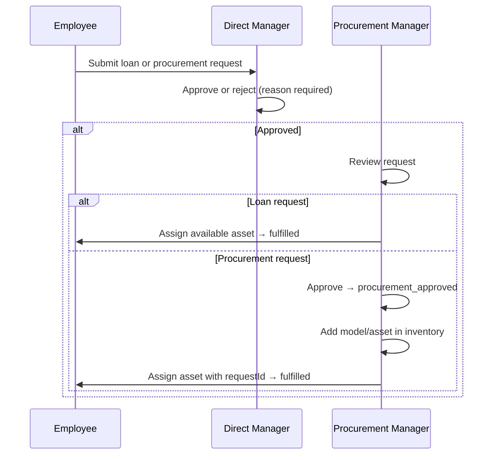

# Equipment Request API

A NestJS REST API for company equipment inventory, loan/procurement requests, multi-level approvals (direct manager → procurement manager), assignments, returns, and notifications.

## Features

- **Four roles** — `employee`, `direct_manager`, `procurement_manager`, `admin` with hierarchical access control
- **Two request types** — Loan (existing inventory) and procurement (external purchase)
- **Department-based routing** — Requests go to the direct manager of the requester's department
- **Inventory model** — Categories, models, and physical assets with status tracking
- **Assignments & returns** — Full assignment history; managers can request equipment returns
- **Procurement workflow** — Availability checks and procurement approvals
- **Notifications** — Created for approvals, rejections, assignments, returns, and updates
- **JWT authentication** — Register, login, access/refresh tokens (15 min / 7 days), logout, profile (`GET /auth/me`)
- **OpenAPI documentation** — Swagger UI at `/api`

## User Stories

User stories are documented by role in [`docs/user-stories/`](docs/user-stories/README.md):

- [Employee](docs/user-stories/employee.md)
- [Direct Manager](docs/user-stories/direct-manager.md)
- [Procurement Manager](docs/user-stories/procurement-manager.md)
- [Admin](docs/user-stories/admin.md)

Database schema: [docs/database-erd.md](docs/database-erd.md) (Mermaid ERD, viewable on GitHub).

## Tech Stack

| Layer      | Technology            |
| ---------- | --------------------- |
| Framework  | NestJS 11             |
| Language   | TypeScript            |
| Database   | PostgreSQL 16         |
| ORM        | TypeORM (migrations)  |
| Auth       | Passport JWT          |
| Validation | class-validator       |
| Security   | Helmet, rate limiting |
| Testing    | Jest + Supertest      |
| API docs   | Swagger / OpenAPI     |

## Quick Start

### Local development (recommended)

Runs the API on your machine with PostgreSQL in Docker.

```bash
npm install
cp .env.example .env
docker compose up -d postgres
npm run migration:run
npm run seed
npm run start:dev
```

API: `http://localhost:3000` · Swagger: `http://localhost:3000/api`

### Full Docker stack

Runs PostgreSQL and the API in containers. Migrations run automatically on container start.

```bash
npm install
cp .env.example .env
npm run docker:up
npm run seed
```

Do not run `start:dev` alongside `docker:up` — both bind port 3000.

### Demo Credentials (password: `password123`)

| Email                                       | Role                                  |
| ------------------------------------------- | ------------------------------------- |
| `admin@ministryofprogramming.com`           | Admin                                 |
| `pat.procurement@ministryofprogramming.com` | Procurement Manager                   |
| `bob.manager@ministryofprogramming.com`     | Direct Manager (Engineering & Design) |
| `jane.doe@ministryofprogramming.com`        | Employee (Engineering)                |
| `john.smith@ministryofprogramming.com`      | Employee (Design)                     |

**After seed:** John has a pending iPhone loan request; Jane has a procurement request awaiting Pat.

## Approval Workflow



## Module Structure

```
src/modules/
├── auth/                  # Login, register, JWT, refresh tokens, role guards
├── employee/              # Employee entity
├── department/            # Departments and direct managers
├── equipment-category/    # Laptop, Monitor, etc.
├── equipment-model/       # Model catalog (Dell Latitude, etc.)
├── equipment-asset/       # Physical inventory + catalog endpoints
├── equipment-assignment/  # Assignments, returns, manager views
├── request/               # Loan/procurement requests
├── approval/              # Manager and procurement approvals
├── procurement/           # Availability checks
├── notification/          # In-app notifications
└── admin/                 # User and department administration
```

## API Overview

Authenticated endpoints require `Authorization: Bearer <accessToken>` unless noted as public.

### Auth

| Method | Path             | Auth   | Description                              |
| ------ | ---------------- | ------ | ---------------------------------------- |
| POST   | `/auth/register` | Public | Register employee account                |
| POST   | `/auth/login`    | Public | Receive access + refresh token pair      |
| POST   | `/auth/refresh`  | Public | Rotate refresh token, get new token pair |
| POST   | `/auth/logout`   | Public | Revoke refresh token                     |
| GET    | `/auth/me`       | Bearer | Current user profile                     |

### Catalog (public)

| Method | Path                            | Description                     |
| ------ | ------------------------------- | ------------------------------- |
| GET    | `/equipment/catalog`            | Browse models with availability |
| GET    | `/equipment/catalog/similar?q=` | Search similar available models |
| GET    | `/equipment/models/:id`         | Model details                   |
| GET    | `/equipment-categories`         | List equipment categories       |

### Requests & Assignments (Employee)

| Method | Path                         | Description                        |
| ------ | ---------------------------- | ---------------------------------- |
| POST   | `/requests`                  | Create loan or procurement request |
| GET    | `/requests/my`               | Own requests                       |
| GET    | `/requests/:id`              | Request detail                     |
| PATCH  | `/requests/:id/cancel`       | Cancel pending request             |
| GET    | `/requests/:id/timeline`     | Approval timeline                  |
| GET    | `/equipment-assignments/my`  | Assigned equipment                 |
| GET    | `/equipment-assignments/:id` | Assignment detail                  |

### Direct Manager

| Method | Path                                         | Description                     |
| ------ | -------------------------------------------- | ------------------------------- |
| GET    | `/manager/requests/pending`                  | Team requests awaiting approval |
| GET    | `/manager/requests`                          | All team requests               |
| GET    | `/manager/team-equipment`                    | Active team assignments         |
| POST   | `/equipment-assignments/:id/return-request`  | Request equipment return        |
| PATCH  | `/equipment-assignments/:id/complete-return` | Mark returned                   |

### Approvals

| Method | Path                         | Description              |
| ------ | ---------------------------- | ------------------------ |
| GET    | `/approvals/my`              | Pending approval steps   |
| GET    | `/approvals/:id`             | Approval step detail     |
| PATCH  | `/approvals/:stepId/approve` | Approve step             |
| PATCH  | `/approvals/:stepId/reject`  | Reject (reason required) |

### Procurement Manager

| Method         | Path                                     | Description                               |
| -------------- | ---------------------------------------- | ----------------------------------------- |
| GET            | `/procurement/approvals`                 | Requests awaiting procurement             |
| GET            | `/procurement/requests/:id/availability` | Check asset availability                  |
| GET            | `/inventory`                             | Full asset inventory                      |
| GET            | `/inventory/stats`                       | Inventory statistics                      |
| GET            | `/equipment/models/:id/similar`          | Find similar models for procurement       |
| GET/POST       | `/equipment-categories`                  | List (public) / create categories         |
| GET/POST/PATCH | `/equipment-models`                      | Manage models                             |
| GET/POST/PATCH | `/equipment-assets`                      | Manage assets                             |
| PATCH          | `/equipment-assets/:id/status`           | Update asset status                       |
| PATCH          | `/equipment-assets/:id/retire`           | Retire an asset                           |
| POST           | `/equipment-assets/:id/assign`           | Assign asset (optionally link to request) |
| DELETE         | `/equipment-assets/:id`                  | Delete unused or eligible retired asset   |

### Admin

| Method | Path                              | Description         |
| ------ | --------------------------------- | ------------------- |
| GET    | `/admin/users`                    | List all users      |
| POST   | `/admin/users`                    | Create user         |
| GET    | `/admin/users/:id`                | Get user by ID      |
| PATCH  | `/admin/users/:id`                | Update user profile |
| PATCH  | `/admin/users/:id/role`           | Change role         |
| PATCH  | `/admin/users/:id/status`         | Activate/deactivate |
| POST   | `/admin/users/:id/reset-password` | Reset password      |
| DELETE | `/admin/users/:id`                | Delete user         |
| GET    | `/admin/departments`              | List departments    |
| POST   | `/admin/departments`              | Create department   |
| PATCH  | `/admin/departments/:id`          | Update department   |
| DELETE | `/admin/departments/:id`          | Delete department   |

### Notifications

| Method | Path                          | Description        |
| ------ | ----------------------------- | ------------------ |
| GET    | `/notifications`              | List notifications |
| GET    | `/notifications/unread-count` | Unread count       |
| PATCH  | `/notifications/:id/read`     | Mark read          |
| PATCH  | `/notifications/read-all`     | Mark all read      |

## Security

- **Helmet** — HTTP security headers on all responses
- **Rate limiting** — 10 requests per 60 seconds per IP (global)
- **CORS** — Configurable via `CORS_ORIGIN` (default `http://localhost:3000`)
- **Token lifetimes** — Access tokens default to 15 minutes; refresh tokens to 7 days. Clients should call `POST /auth/refresh` when the access token expires (401). Refresh tokens rotate on each refresh; logout revokes the refresh token.

## Testing

```bash
npm test              # Unit tests (≥70% coverage enforced)
npm run test:cov      # Coverage report
npm run test:e2e      # Integration/e2e (requires PostgreSQL)
```

E2E tests cover loan/procurement workflows, cancellations, rejections, returns, asset delete/retire rules, admin actions, RBAC, and notifications.

## Environment Variables

See `.env.example`.

| Variable                 | Description                                        |
| ------------------------ | -------------------------------------------------- |
| `DB_HOST`                | PostgreSQL host (`localhost` or `postgres`)        |
| `DB_PORT`                | PostgreSQL port (`5433` locally, `5432` in Docker) |
| `DB_USERNAME`            | Database user                                      |
| `DB_PASSWORD`            | Database password                                  |
| `DB_NAME`                | Database name                                      |
| `JWT_SECRET`             | Secret for signing access tokens                   |
| `JWT_EXPIRES_IN`         | Access token lifetime (default `15m`; e.g. `1h`)   |
| `JWT_REFRESH_EXPIRES_IN` | Refresh token lifetime (default `7d`)              |
| `PORT`                   | API listen port (default `3000`)                   |
| `CORS_ORIGIN`            | Allowed CORS origin                                |
| `RUN_MIGRATIONS`         | Run migrations on Docker container start           |
| `REDIS_URL`              | Reserved for future use (optional Redis profile)   |

## License

UNLICENSED — private project.
