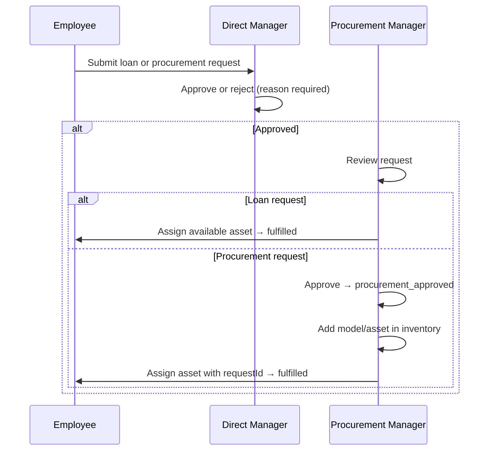

# Equipment Request API

A NestJS REST API for company equipment inventory, loan/procurement requests, multi-level approvals (direct manager → procurement manager), assignments, returns, and notifications.

## Features

- **Four roles** — `employee`, `direct_manager`, `procurement_manager`, `admin` with hierarchical access control
- **Two request types** — Loan (existing inventory) and procurement (external purchase)
- **Department-based routing** — Requests go to the direct manager of the requester's department
- **Inventory model** — Categories, models, and physical assets with status tracking
- **Assignments & returns** — Full assignment history; managers can request equipment returns
- **Procurement workflow** — Availability checks and procurement approvals
- **Notifications** — Created for approvals, rejections, assignments, returns, and updates
- **JWT authentication** — Register, login, profile (`GET /auth/me`)
- **OpenAPI documentation** — Swagger UI at `/api`

## User Stories

User stories are documented by role in [`docs/user-stories/`](docs/user-stories/README.md):

- [Employee](docs/user-stories/employee.md)
- [Direct Manager](docs/user-stories/direct-manager.md)
- [Procurement Manager](docs/user-stories/procurement-manager.md)
- [Admin](docs/user-stories/admin.md)

Database schema: [docs/database-erd.md](docs/database-erd.md) (Mermaid ERD, viewable on GitHub).

## Tech Stack

| Layer      | Technology           |
| ---------- | -------------------- |
| Framework  | NestJS 11            |
| Language   | TypeScript           |
| Database   | PostgreSQL 16        |
| ORM        | TypeORM (migrations) |
| Auth       | Passport JWT         |
| Validation | class-validator      |
| Testing    | Jest + Supertest     |
| API docs   | Swagger / OpenAPI    |

## Quick Start

```bash
npm install
npm run docker:up
cp .env.example .env
npm run migration:run
npm run seed
npm run start:dev
```

API: `http://localhost:3000` · Swagger: `http://localhost:3000/api`

### Demo Credentials (password: `password123`)

| Email                         | Role                                  |
| ----------------------------- | ------------------------------------- |
| `admin@example.com`           | Admin                                 |
| `pat.procurement@example.com` | Procurement Manager                   |
| `bob.manager@example.com`     | Direct Manager (Engineering & Design) |
| `jane.doe@example.com`        | Employee (Engineering)                |
| `john.smith@example.com`      | Employee (Design)                     |

**After seed:** John has a pending iPhone loan request; Jane has a procurement request awaiting Pat.

## Approval Workflow



## Module Structure

```
src/modules/
├── auth/                  # Login, register, JWT, role guards
├── employee/              # Employee entity
├── department/            # Departments and direct managers
├── equipment-category/    # Laptop, Monitor, etc.
├── equipment-model/       # Model catalog (Dell Latitude, etc.)
├── equipment-asset/       # Physical inventory + catalog endpoints
├── equipment-assignment/  # Assignments, returns, manager views
├── request/               # Loan/procurement requests
├── approval/              # Manager and procurement approvals
├── procurement/           # Availability checks
├── notification/          # In-app notifications
└── admin/                 # User and department administration
```

## API Overview

Authenticated endpoints require `Authorization: Bearer <token>` unless noted.

### Auth

| Method | Path             | Description               |
| ------ | ---------------- | ------------------------- |
| POST   | `/auth/register` | Register employee account |
| POST   | `/auth/login`    | Receive JWT               |
| GET    | `/auth/me`       | Current user profile      |

### Catalog & Requests (Employee)

| Method | Path                            | Description                        |
| ------ | ------------------------------- | ---------------------------------- |
| GET    | `/equipment/catalog`            | Browse models with availability    |
| GET    | `/equipment/catalog/similar?q=` | Search similar available models    |
| GET    | `/equipment/models/:id`         | Model details                      |
| POST   | `/requests`                     | Create loan or procurement request |
| GET    | `/requests/my`                  | Own requests                       |
| GET    | `/requests/:id`                 | Request detail                     |
| PATCH  | `/requests/:id/cancel`          | Cancel pending request             |
| GET    | `/requests/:id/timeline`        | Approval timeline                  |
| GET    | `/equipment-assignments/my`     | Assigned equipment                 |
| GET    | `/equipment-assignments/:id`    | Assignment detail                  |

### Direct Manager

| Method | Path                                         | Description                     |
| ------ | -------------------------------------------- | ------------------------------- |
| GET    | `/manager/requests/pending`                  | Team requests awaiting approval |
| GET    | `/manager/requests`                          | All team requests               |
| GET    | `/manager/team-equipment`                    | Active team assignments         |
| POST   | `/equipment-assignments/:id/return-request`  | Request equipment return        |
| PATCH  | `/equipment-assignments/:id/complete-return` | Mark returned                   |

### Approvals

| Method | Path                         | Description              |
| ------ | ---------------------------- | ------------------------ |
| GET    | `/approvals/my`              | Pending approval steps   |
| GET    | `/approvals/:id`             | Approval step detail     |
| PATCH  | `/approvals/:stepId/approve` | Approve step             |
| PATCH  | `/approvals/:stepId/reject`  | Reject (reason required) |

### Procurement Manager

| Method                | Path                                     | Description                               |
| --------------------- | ---------------------------------------- | ----------------------------------------- |
| GET                   | `/procurement/approvals`                 | Requests awaiting procurement             |
| GET                   | `/procurement/requests/:id/availability` | Check asset availability                  |
| GET                   | `/inventory`                             | Full asset inventory                      |
| GET                   | `/inventory/stats`                       | Inventory statistics                      |
| GET/POST              | `/equipment-categories`                  | Manage categories                         |
| GET/POST/PATCH        | `/equipment-models`                      | Manage models                             |
| GET/POST/PATCH/DELETE | `/equipment-assets`                      | Manage assets                             |
| POST                  | `/equipment-assets/:id/assign`           | Assign asset (optionally link to request) |

### Admin

| Method                | Path                              | Description           |
| --------------------- | --------------------------------- | --------------------- |
| GET/POST/PATCH/DELETE | `/admin/users`                    | User management       |
| PATCH                 | `/admin/users/:id/role`           | Change role           |
| PATCH                 | `/admin/users/:id/status`         | Activate/deactivate   |
| POST                  | `/admin/users/:id/reset-password` | Reset password        |
| GET/POST/PATCH/DELETE | `/admin/departments`              | Department management |

### Notifications

| Method | Path                          | Description        |
| ------ | ----------------------------- | ------------------ |
| GET    | `/notifications`              | List notifications |
| GET    | `/notifications/unread-count` | Unread count       |
| PATCH  | `/notifications/:id/read`     | Mark read          |
| PATCH  | `/notifications/read-all`     | Mark all read      |

## Testing

```bash
npm test              # Unit tests (≥70% coverage enforced)
npm run test:cov      # Coverage report
npm run test:e2e      # Integration/e2e (requires PostgreSQL)
```

E2E tests cover loan/procurement workflows, cancellations, rejections, returns, asset delete/retire rules, admin actions, RBAC, and notifications.

## Environment Variables

See `.env.example`. Key values: `DB_*`, `JWT_SECRET`, `JWT_EXPIRES_IN`, `PORT`.

## License

UNLICENSED — private project.
