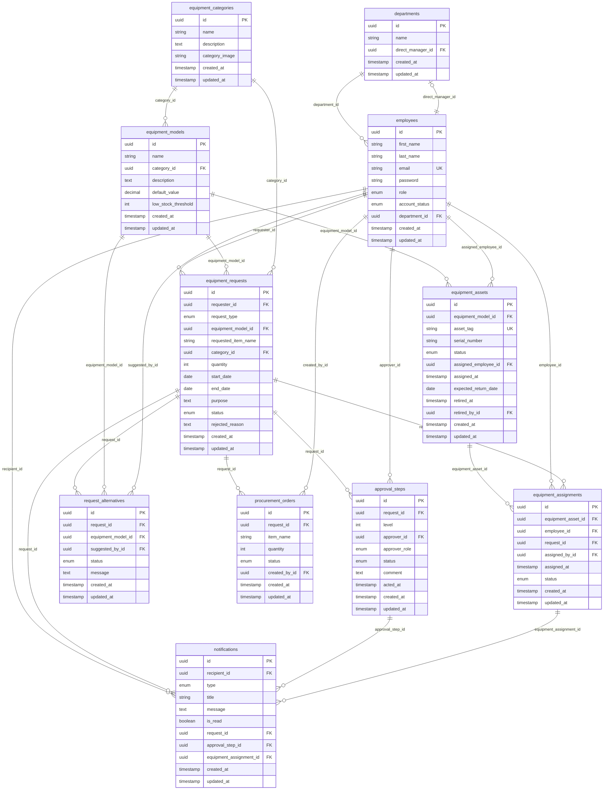

# Database ERD

Entity-relationship diagram for the PostgreSQL schema managed by TypeORM migrations.

## Entity relationship diagram



## Tables

| Table                   | Description                                         |
| ----------------------- | --------------------------------------------------- |
| `departments`           | Org units; each may have one `direct_manager_id`    |
| `employees`             | Users, roles, department membership, account status |
| `equipment_categories`  | High-level groupings (Laptop, Monitor, …)           |
| `equipment_models`      | Product types within a category                     |
| `equipment_assets`      | Physical inventory items                            |
| `equipment_assignments` | Assignment and return history                       |
| `equipment_requests`    | Loan and procurement requests                       |
| `approval_steps`        | Manager and procurement approval records            |
| `request_alternatives`  | Suggested substitute models                         |
| `procurement_orders`    | External purchase tracking                          |
| `notifications`         | Workflow notifications                              |

## Key enums

| Column                            | Values                                                                                                                  |
| --------------------------------- | ----------------------------------------------------------------------------------------------------------------------- |
| `employees.role`                  | `employee`, `direct_manager`, `procurement_manager`, `admin`                                                            |
| `employees.account_status`        | `active`, `inactive`                                                                                                    |
| `equipment_assets.status`         | `available`, `in_use`, `reserved`, `return_requested`, `maintenance`, `retired`                                         |
| `equipment_requests.request_type` | `loan`, `procurement`                                                                                                   |
| `equipment_requests.status`       | `pending_manager_approval`, `pending_procurement_approval`, `purchase_pending`, `fulfilled`, `rejected`, `cancelled`, … |
| `approval_steps.approver_role`    | `direct_manager`, `procurement_manager`, `admin`                                                                        |
| `approval_steps.status`           | `pending`, `approved`, `rejected`, `skipped`                                                                            |

## Inspect schema in Docker

With `npm run docker:up`:

```bash
# List tables
docker exec -it equipment-api-postgres psql -U equipment -d equipment_api -c "\dt"

# Describe a table
docker exec -it equipment-api-postgres psql -U equipment -d equipment_api -c "\d employees"

# Export schema for external ERD tools
docker exec equipment-api-postgres pg_dump -U equipment -d equipment_api --schema-only > schema.sql
```

**Local connection:** `localhost:5433` · user `equipment` · password `equipment` · database `equipment_api`

Use DBeaver, TablePlus, pgAdmin, or [dbdiagram.io](https://dbdiagram.io) with `schema.sql` for an interactive diagram.

## Source of truth

- Entity definitions: `src/modules/**/entities/*.entity.ts`
- Migrations: `src/database/migrations/`

See also [equipment.md](./equipment.md) for business rules and [user-stories/](./user-stories/README.md) for role specifications.
